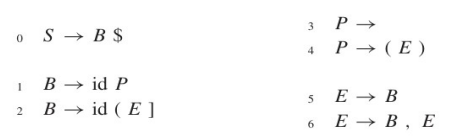
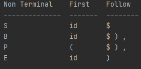
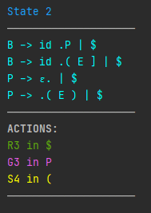
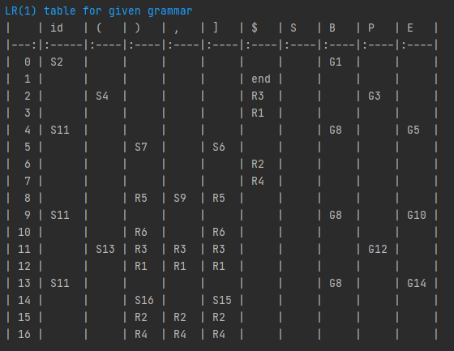
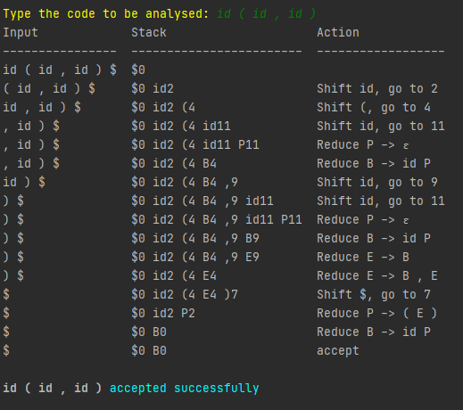
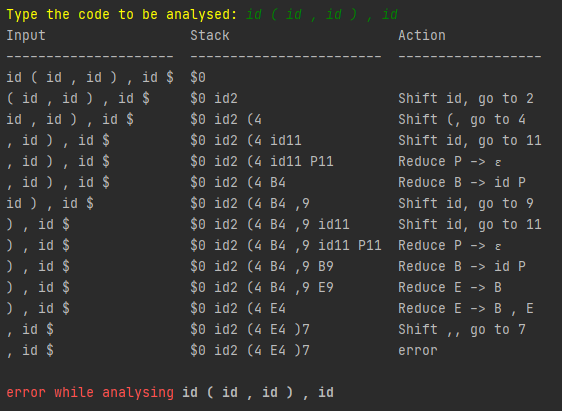

# First/Follow - Autômato LR(1) - Analisador Sintático
##  2º Trabalho de Compiladores - 2022.1

 

* Aluno: Raphael Carvalho Garcia
* Matrícula: 412557

   

### **Introdução**
O trabalho é baseado **somente** na seguinte gramática: 

   

### **Conteúdo**
O trabalho consiste em três questões. Cada questão está resolvida em um código em Python, sendo eles:

1) *First_Follow.py* - apresenta uma tabela com todos os *first* e *follow* de cada símbolo não-terminal da gramática.

2) *lr1_auto.py* - apresenta cada estado em um autômato LR(1) da gramática, com suas respectivas ações. Além disto, também apresenta no final uma tabela LR(1) feita a partir do autômato.

3) *synth_analysis.py* - realiza uma análise sintática de um input dado pelo usuário e, baseado na tabela da questão anterior, apresenta o passo-a-passo da análise, além do resultado final (*accept* ou *error*)

    

### **Instruções e avisos**
* Para os dois primeiros arquivos, basta executar. Cada um já tem funções prontas  e definidas e irá mostrar de acordo com o seu conteúdo.

* Para a terceira questão, vale notar que **o input deve ser separado por espaço a cada caractere**. Caso contrário, irá apresentar erro. Além disto, como a questão foi feita baseada somente na gramática dada, inserir algum caractere fora da gramática (*num*, *+*, *var*, etc) também resultará em erro! Então, **insira somente caracteres da grmática**! Os caracteres permitidos são:
~~~python
non_terminals = ['S', 'B', 'P', 'E']

terminals = ['id', '(', ')', ',', ']', '$']
~~~

   

### **Prints**
Tabela first/follow

 

Exemplo de um estado com todas as ações

  

Tabela LR(1)

  

Exemplo de input aceito na gramática

  

Exemplo de input rejeitado na gramática

