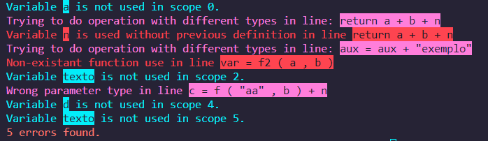
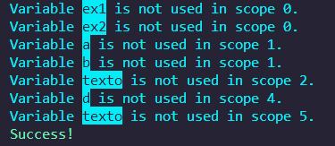

# Analisador Semântico
## 3º Trabalho de Compiladores - 2022-1

* Aluno: Raphael Carvalho Garcia
* Matrícula: 412557

 

### Introdução
O trabalho é fazer um código baseado nos seguintes requisitos:

A linguagem **A** tem as seguintes características:

  

### Conteúdo
Seguindo o padrão dos outros trabalhods, o terceiro também foi feito em Python, e consiste nos seguintes arquivos:
* **semantic_analysis.py** - arquivo principal que realiza a análise semântica de um código (escrito, em texto, em outro arquivo), baseado na linguagem A;
* **code.txt** - arquivo de texto que contém o código da linguagem A onde será feita a análise semântica.

  

### Instruções
A análise semântica será feita baseada no código do arquivo **code.txt**. Para alterar, basta modificar o código no arquivo.
Após isto, basta executar o arquivo em Python.

  

### Avisos
* É extremamente importante que o código esteja devidamente separado e identado. Um espaço para cada "token", novas linhas para cada escopo ou declaração de variáveis, ponto-e-vírgula após cada linha, etc. Em dúvida, basta seguir o padrão que está no código de exemplo.

* Há um bug que não consigo resolver quando há uma variável que é atribuída com uma função. Se a função não vier primeiro, o código rodará erroneamente. Por exemplo:
~~~
int a = f ( b , c ) + n 
funciona!

int a = n + f ( b , c ) 
erro! :(
~~~

  

### Prints

Código com todos os possíveis erros

 

Código com variáveis não usadas, mas com nenhum outro erro

 

Código sem nenhum erro ou problema

