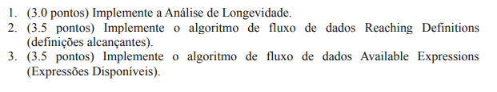
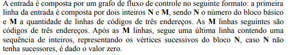
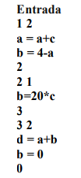
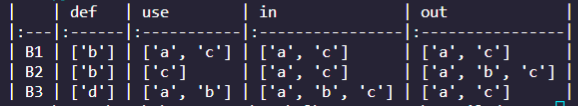

# *Liveness analysis* - *Reaching Definitions* - *Available Expressions*
##  4º Trabalho de Compiladores - 2022.1 (Opção 3)

 

* Aluno: Raphael Carvalho Garcia
* Matrícula: 412557

 

O trabalho consiste nas seguintes questões:
 

   

## **Conteúdo**
Cada questão foi respondida em um arquivo Python diferente:
* **liveness.py** - algoritmo para Análise de Longevidade, questão 1;

* **reaching_defs.py** - algoritmo para Reaching Definitions - questão 2;

* **available_expr.py** - algoritmo para Available Expressions - questão 3;

* **input.txt** - arquivo de texto utilizado como entrada para os algoritmos do trabalho.

   

### **Entrada/Saída**
A entrada de *todos* os algoritmos 
é baseada na seguinte definição:

 

 

Usaremos de exemplo a seguinte entrada:

 

 

No arquivo *input.txt*, é dada a exata entrada do exemplo, mas o arquivo pode ser modificado para outras entradas (desde que dentro do padrão fornecido).

 

A saída de todos os arquivos é a mesma: uma tabela em formato de markdown para os conjuntos *in* e *out* da entrada, para cada algoritmo. Além disso, a tabela também contém os conjuntos *gen*, *kill* para **Reaching Definitions** e **Available Expressions**, e os conjuntos *use* e *def* para **Liveness Analysis**. Cada saída pode ser vista mais detalhadamente na seção de **Prints**.

   

## **Instruções**
Basta executar o código. Se necessário, altere o arquivo *input.txt* como desejado, mas dentro dos padrões de entrada fornecidos. Qualquer mudança fora dos padrões (uma linha adicional, números de bloco repetidos, número de entradas no bloco errado, etc) resultará em erro ou, em alguns casos, resultados errôneos.

   

## **Avisos**
A entrada deve, além de seguir os padrões, também ser devidamente separado com espaços. A falta de espaços em alguns casos, como linhas de entrada dos blocos ou ao dizer qual o número do bloco e quantas entradas possui, resultará em erros de execução. 

   

## **Prints**
* Algoritmo de *Liveness Analysis*
 

 

* Algoritmo de *Reaching Definitions*
 

 

* Algoritmo de *Available Expressions* (foi necessário separar pois faltou espaço no terminal)
 

 

